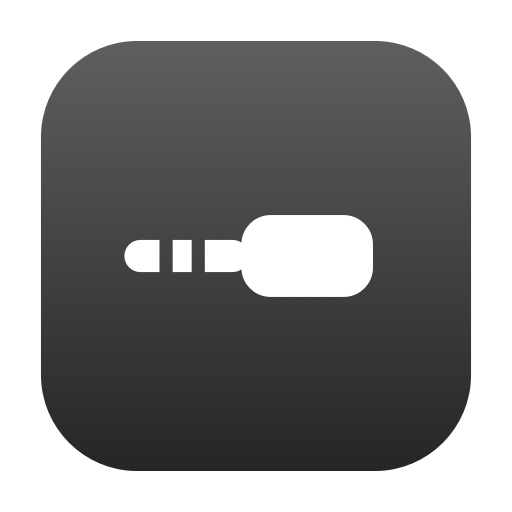
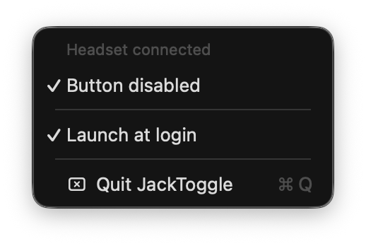
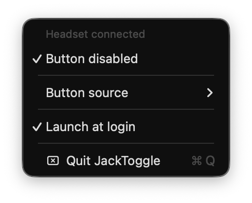
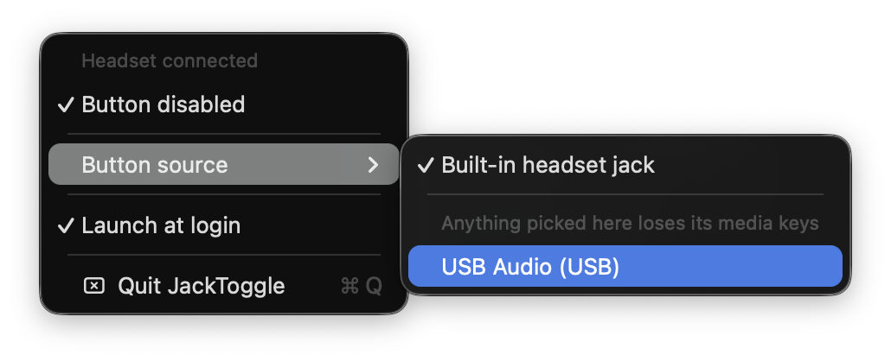

<p align="center">
  
</p>

# JackToggle

Menu bar app that turns the 3.5mm headset's inline button on and off.

<p align="center">
  
</p>

## How it works

macOS exposes the inline button as its own HID device, separate from the keyboard —
Transport `Audio`, usage page `12` (Consumer), usage `1` (Consumer Control). The app
opens **only that device** with `kIOHIDOptionsTypeSeizeDevice`, which routes its input
exclusively to JackToggle, so the system stops seeing the presses.

Nothing else is affected: the keyboard's media keys keep working and audio is untouched,
since that runs through CoreAudio rather than this device. No `sudo`, no SIP changes, no
reboot, no kernel extensions. The grab lasts only as long as the process, so quitting
restores the button. The one cost is an **Input Monitoring** permission grant.

## Other hardware

Transport `Audio` is what makes the automatic match safe to seize blind — it excludes
the internal keyboard and every USB keyboard, which publish their media keys on the same
Consumer page. It excludes USB headsets and dongles too, since those arrive over
Transport `USB`.

Widening the match to all Consumer Controls would pick those up along with any attached
keyboard, and that isn't a symmetric mistake: a seize is exclusive, so a wrong match
silently kills an unrelated device's media keys, while a missed match just says
"No headset connected". So the widening isn't automatic. When other hardware is
attached, the menu grows a **Button source** submenu listing every other Consumer
Control device, and seizes only the one that's picked.

<p align="center">
  
</p>

<p align="center">
  
</p>

The choice is stored as VID/PID and handed back to IOKit as a matching dictionary, so
replugging re-seizes on its own. The usage keys stay in that dictionary — one VID/PID
spans several HID devices, and only the Consumer Control one should ever be seized.

### Presence comes from CoreAudio, not HID

The codec publishes the jack's HID device whether or not anything is plugged in, so HID
presence means *the machine has a jack*, never *something is in it*. CoreAudio does know:
the built-in output device carries a data source that moves off the internal speakers on
insert, so `JackPresence` reads that and the automatic target requires both signals.

The check is written as "not the internal speakers" rather than "is headphones", because
with the jack empty no headphone source id is listed at all — only the speakers are.
A manual target needs none of this: a USB dongle's HID node really does come and go with
the hardware.

## Build and run

```bash
./build.sh --install
```

Builds into `build/`, then replaces `/Applications/JackToggle.app` and relaunches. Drop
`--install` to build without touching `/Applications`. Only the Command Line Tools are
needed; Xcode is not.

## First run

1. Click the plug icon in the menu bar → **Button enabled**.
2. The first toggle fails with a permission prompt — that's expected. Click
   **Open System Settings** and enable JackToggle under
   *Privacy & Security › Input Monitoring*.
3. Toggle again. The icon gains a slash, and the menu shows "Blocked a press Ns ago"
   on each press of the inline button.

**After every rebuild:** the binary is ad-hoc signed, so a rebuild changes its signature
and macOS drops the Input Monitoring grant. The app notices and switches itself off. To
restore it, remove JackToggle from the Input Monitoring list with **−**, then add it back.

## Layout

- `Sources/HeadsetHID.swift` — device matching, target selection, seizing, permissions
- `Sources/JackPresence.swift` — whether the jack is occupied, via CoreAudio
- `Sources/PlugIcon.swift` — the plug glyph, menu bar image and app icon
- `Sources/AppDelegate.swift` — status item, menu, state persistence
- `Tools/GenerateIcon.swift` — writes the `.iconset` for `iconutil`
- `Tools/HIDProbe.swift` — diagnostic, see below
- `build.sh` — compiles, assembles and ad-hoc signs the `.app`

The plug glyph is drawn in `PlugIcon.swift` rather than taken from SF Symbols, because
macOS already uses `headphones` in Control Center and the volume menu. The menu bar
image and the `.icns` come from the same geometry, and `build.sh` regenerates the
iconset on every build.

## Diagnostics

`Tools/HIDProbe.swift` lists every attached HID device with the properties the app
matches on.

```bash
swiftc -swift-version 5 -framework CoreAudio Sources/JackPresence.swift Tools/HIDProbe.swift -o /tmp/hidprobe && /tmp/hidprobe
```

Run it first when the grab stops working on unfamiliar hardware: the row for the
connected device shows why the matching dictionary isn't catching it. Its second line
reports whether the jack is occupied, which the device rows cannot tell you.

Its first line reports what `IOHIDManagerOpen` returned:

| | |
|---|---|
| `kIOReturnSuccess` | Input Monitoring granted |
| `kIOReturnNotPermitted` | grant Input Monitoring |
| `kIOReturnExclusiveAccess` | something already holds a seize — JackToggle is blocking |
